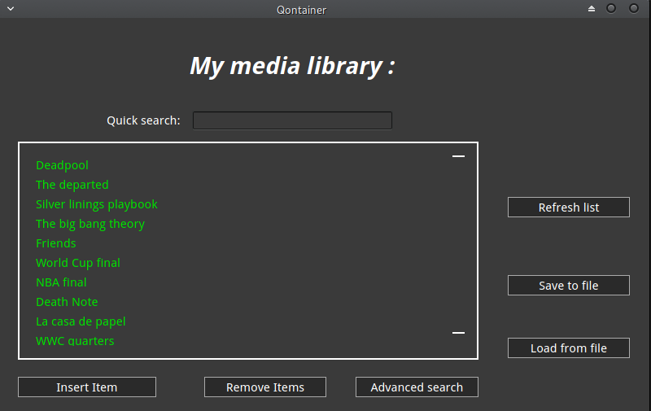
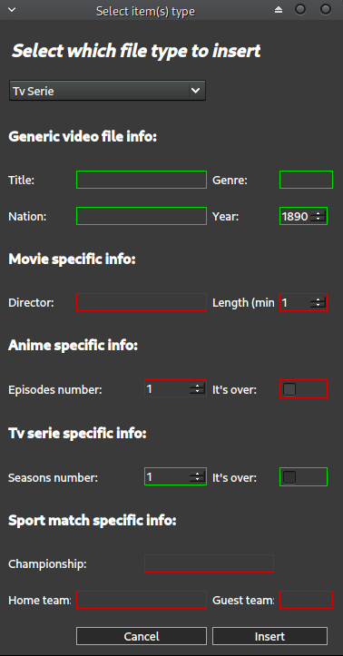
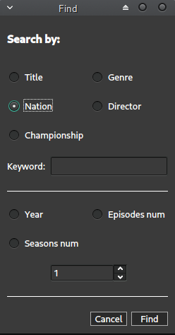

# QONTAINER

Object Oriented Programming project made by Fomodei94.

## Development infos

* **Programming language:** C++

* **Framework:** Qt 5.12

* **Design pattern:** Model-View

More details on [Project report](https://github.com/Fomodei94/Qontainer/blob/develop/Relazione/relazione.pdf)

## User interface example snapshots

* Main window:

* Adding an object to library:

* Advanced search window:

## Contact me

| Name | Github profile | Email |
| ------ | ------ | ------ |
| Federico Omodei | https://github.com/Fomodei94 | federico.omodei[at]gmail.com
